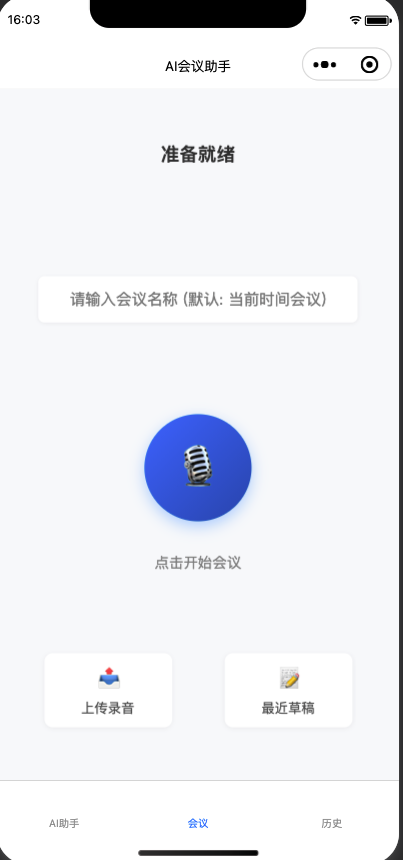
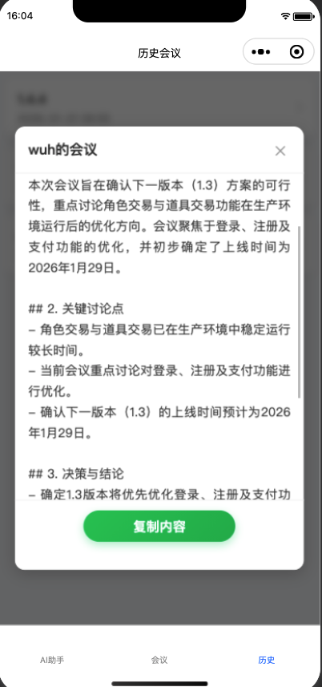

# AI-MEETING - 企业级 AI 智能会议助手

🔒 100% 本地化部署，数据隐私零泄露！

AI-MEETING 是一款全栈式 AI 会议解决方案。它不仅能将在线会议以及会议录音转录为文字并生成会议纪要，更内置了 RAG（检索增强生成）知识库，让你的历史会议记录变成可交互、可查询的“企业大脑”，并支持企业小程序接入（如企业微信/钉钉/微信小程序），实现随时上传、查看与检索。

## 🌟 核心功能
- 🛡️ 极致安全：从语音识别（Whisper、Paraformer）到大模型（Ollama / OpenAI / 通义千问）再到向量库（FAISS/Chroma），全链路支持离线或在线
- 🧠 会议知识库（RAG）：自动将会议纪要向量化入库，跨会议检索与问答
- 🖥️ 服务接口：FastAPI 提供上传、转写、生成纪要、检索等 HTTP API
- 📱 企业小程序：提供轻量化入口，支持上传、查看历史与智能问答
- 📧 自动化工作流（可扩展）：会议结束后自动推送纪要

## 🛠️ 技术架构
模块化设计，清晰职责，易于维护与扩展：
```
app/
  models.py       # 数据模型与返回体
  storage.py      # SQLite 存储
asr/
  whisper.py      # Whisper（faster-whisper）实现
  paraformer.py   # FunASR Paraformer 实现
  transcribe.py   # ASR 调度入口（按配置选择 whisper/paraformer）
llm/
  ollama.py       # Ollama（LangChain）实现
  openai.py       # OpenAI（LangChain）实现
  tongyi.py       # 通义千问 DashScope（LangChain）实现
  generate.py     # LLM 统一入口（按 LLM_PROVIDER 调度）
rag/
  index.py        # FAISS/Chroma 索引；Embeddings 纯 LangChain，带回退策略
conf/
  settings.py     # 全局配置（路径与模型）
common/
  utils.py        # 文本分块等工具
tools/
  delete_meeting.py  # 会议数据删除工具（按ID或清空全部）
data/
  audio/          # 上传音频
  mettings/       # 纪要 Markdown（<规范化标题>-<会议ID>.md）
  meetings.db     # SQLite 数据库
  faiss/          # 索引文件
  faiss_meta.json
main.py           # FastAPI 入口与路由
README.md
environment.yml
requirements.txt
```

## ⚙️ 配置
- 配置文件：conf/config.yaml（支持 .env/.env.example 覆盖）
- 关键项：
  - ASR_PROVIDER: whisper | paraformer（默认 whisper）
  - WHISPER_MODEL、ASR_MODEL：模型名或路径
  - LLM_PROVIDER: ollama | openai | dashscope（tongyi 自动归一化为 dashscope）
  - DEFAULT_LLM_MODEL：默认大模型（如 qwen2.5:7b）
  - EMBED_PROVIDER: ollama | openai | dashscope（RAG 向量化提供方）
  - RAG_PROVIDER: faiss | chromadb（向量库存储类型）
  - MEETINGS_DIR：纪要 Markdown 存放目录（默认 data/mettings）
  - OLLAMA_BASE_URL / LLM_BASE_URL / LLM_API_KEY / DASHSCOPE_API_KEY
- 开发环境：
  - APP_ENV=dev 时优先加载 .env.example；否则加载 .env

## 🚀 使用 conda 快速部署
```bash
# 1) 准备环境（推荐）
  conda create --name ai-meeting python=3.11
  conda env create -f environment.yml
  conda activate ai-meeting

  # 如遇冲突可手动创建
  # conda activate ai-meeting
  # pip install -r requirements.txt

# 准备本地推理（示例）
# ollama pull qwen2.5:7b
# ollama pull nomic-embed-text
# 2) Mac 安装 ffmpeg（用于音频转码）
brew install ffmpeg

# 3) 启动服务
APP_ENV=dev python -m uvicorn main:app --host 0.0.0.0 --port 8000
```

## 项目示例
- 在线会议/上传会议

- AI 智能问答

- 历史会议


## 🗑️ 数据清理
- 删除工具：[tools/delete_meeting.py](file:///Users/wuh/server/tools/delete_meeting.py)
  - 删除指定会议：`python tools/delete_meeting.py --id 23`
  - 删除全部会议：`python tools/delete_meeting.py --all`
  - 会同时删除数据库记录、音频文件、纪要 Markdown、以及向量库条目（FAISS 重建或 Chroma 清空目录）

## 📒 纪要存储
- 生成的纪要自动保存为 Markdown 到 MEETINGS_DIR（默认 data/mettings）
- 命名规则：`<规范化标题>-<会议ID>.md`

## ⚠️ 注意事项
- 首次转写或生成可能需要下载模型（确保网络或预拉取）
- 本项目默认走纯本地链路；如启用 DashScope/OpenAI 等需要在 .env/config 中设置相应 key 与 base_url
- 建议 macOS 安装 ffmpeg 以支持音频转码与更多格式
